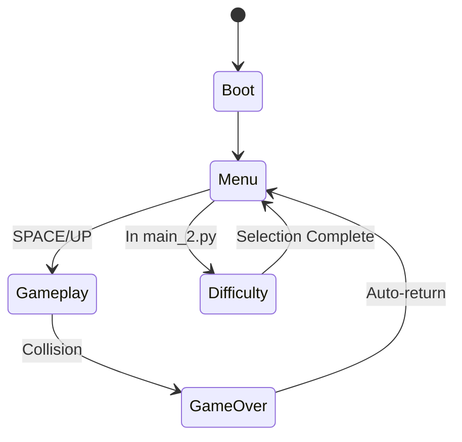
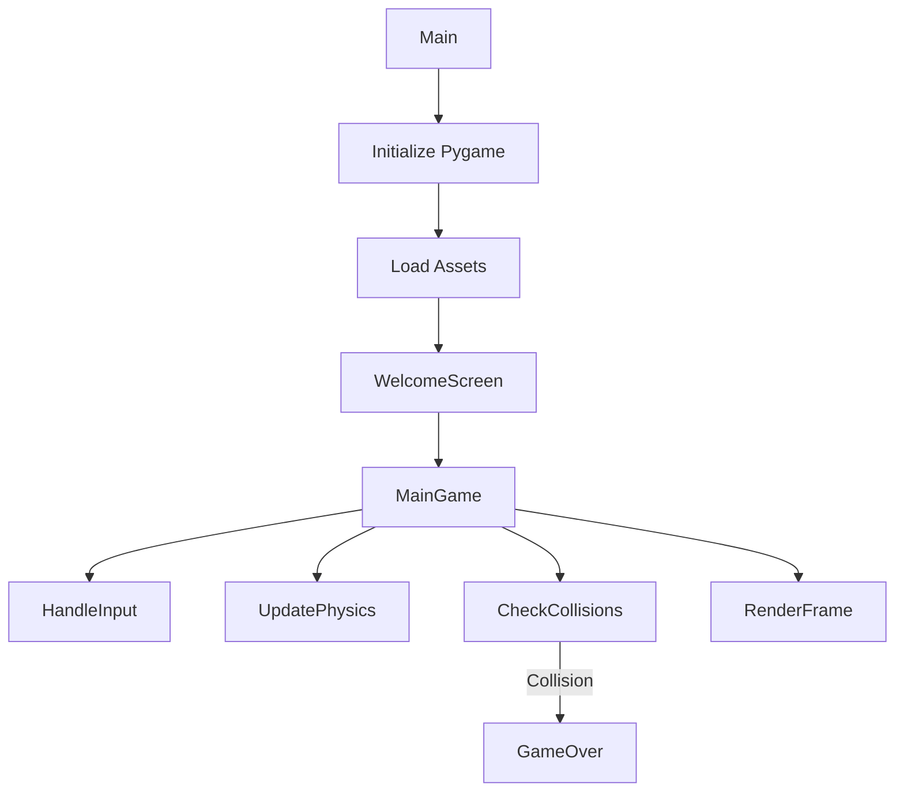
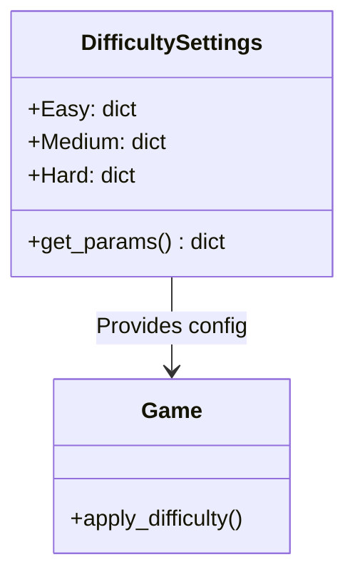
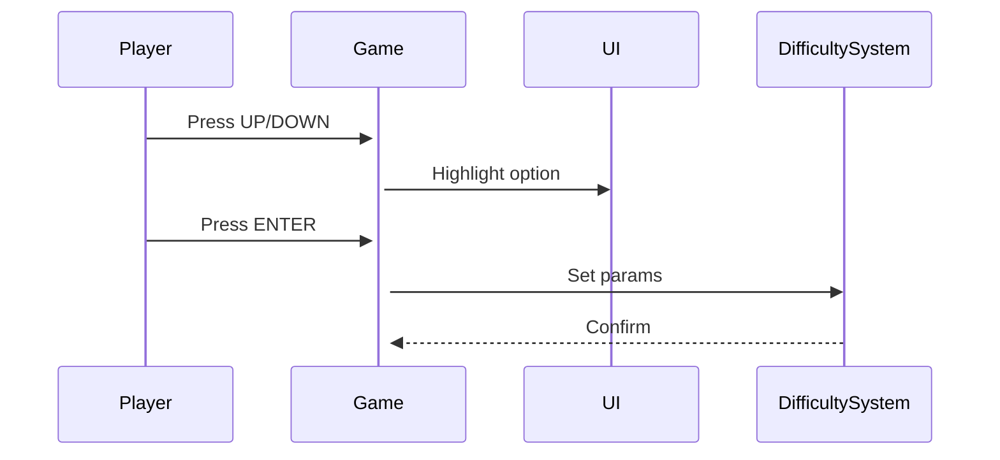

markdown
# 🎮 Flappy Bird Professional Documentation

  


---

## 📚 Table of Contents
1. [Architecture Overview](#-architecture-overview)
2. [Version Comparison](#-version-comparison)
3. [Core Systems](#-core-systems)
4. [Enhanced Features](#-enhanced-features)
5. [Assets Reference](#-assets-reference)
6. [Debugging Guide](#-debugging-guide)
7. [Roadmap](#-roadmap)
8. [License](#-license)

---

## 🏗️ Architecture Overview

### 🎮 Game State Machine



**Explanation**:  
- The game begins at the `Boot` state which sets up resources.  
- After boot, it transitions to the `Menu`, where difficulty settings can be adjusted.  
- Pressing SPACE/UP starts `Gameplay`.  
- Collision leads to `GameOver`, which returns to the menu automatically.  
- Difficulty screen exists only in `main_2.py` and feeds back into Menu upon selection.

---

### ⚙️ Execution Flow



**Explanation**:  
- After initializing Pygame and loading assets, the game enters the welcome screen.  
- The main loop handles user input, physics updates, collision detection, and rendering.  
- A collision event transitions to the GameOver sequence.

---

## 🔄 Version Comparison

### ✅ Feature Matrix

| Feature               | `main.py` | `main_2.py` |
|-----------------------|-----------|-------------|
| Difficulty System     | ❌        | ✅          |
| High Score Sound      | Basic     | Optimized   |
| Menu Navigation       | ❌        | ✅          |
| Dynamic Pipe Gap      | Fixed     | Variable    |
| Speed Adjustment      | ❌        | ✅          |

### 📝 Code Difference Snapshot

```diff
# main.py (Original)
def getRandomPipe():
    offset = SCREENHEIGHT / 3
    y2 = offset + random.randrange(...)

# main_2.py (Enhanced)
def getRandomPipe(pipe_gap=140):
    y2 = offset + random.randrange(...)
    y1 = pipeHeight - y2 + pipe_gap  # Dynamic gap
```

**Explanation**:  
The improved version introduces adjustable pipe gaps based on difficulty, making the game more dynamic and replayable.

---

## ⚙️ Core Systems

### 🕹️ 1. Physics Engine

```python
def update_bird():
    # Apply gravity
    if bird_velocity_y < MAX_VELOCITY:
        bird_velocity_y += GRAVITY
    
    # Handle flap
    if flap_triggered:
        bird_velocity_y = FLAP_IMPULSE
        play_sound('wing')
    
    # Update position
    bird_y += min(bird_velocity_y, GROUND_Y - bird_y - BIRD_HEIGHT)
```

**Explanation**:  
- Gravity increases the bird's downward speed until terminal velocity.
- A flap immediately reverses the velocity, giving an upward boost.
- Vertical position is updated while ensuring the bird doesn't fall through the ground.

| Variable        | Value        | Description                    |
|----------------|--------------|--------------------------------|
| `GRAVITY`      | 1 px/frame²  | Downward acceleration          |
| `FLAP_IMPULSE` | -9 px/frame  | Upward force when flapping     |
| `MAX_VELOCITY` | 10 px/frame  | Limits how fast bird falls     |

---

### 🧱 2. Collision Detection

```python
def check_collision():
    bird_rect = pygame.Rect(bird_x, bird_y, BIRD_WIDTH, BIRD_HEIGHT)
    
    for pipe in pipes:
        upper_rect = pygame.Rect(pipe['x'], pipe['y'], PIPE_WIDTH, PIPE_HEIGHT)
        lower_rect = pygame.Rect(pipe['x'], pipe['y'] + PIPE_GAP, PIPE_WIDTH, PIPE_HEIGHT)
        
        if bird_rect.colliderect(upper_rect) or bird_rect.colliderect(lower_rect):
            return True
```

**Explanation**:  
- Uses axis-aligned bounding boxes (AABB) to detect collision between the bird and pipes.
- Ground and ceiling are handled separately via Y-position thresholds.

| Object       | Method                     | Sound Trigger     |
|--------------|-----------------------------|-------------------|
| Pipes        | Rectangle overlap (`colliderect`) | `hit.wav`        |
| Ground       | Y ≥ GROUND_Y               | `die.wav`         |
| Screen Top   | Y < 0                      | No sound          |

---

## 🆕 Enhanced Features

### 🎚️ Difficulty System Architecture



**Explanation**:  
- `DifficultySettings` stores gap/speed for each difficulty.
- Game queries `get_params()` and adjusts `pipe_gap` and `pipe_speed` accordingly.

```python
DIFFICULTY_SETTINGS = {
    'Easy': {
        'pipe_gap': 160,
        'pipe_speed': 3
    },
    'Hard': {
        'pipe_gap': 120,
        'pipe_speed': 5
    }
}
```

---

### 🧭 Menu Navigation Flow



**Explanation**:  
- User uses arrow keys to choose difficulty.
- On ENTER, parameters are applied.
- Game transitions back to menu and then gameplay with new settings.

---

## 🖼️ Assets Reference

### 🖌️ Sprite Specifications

| Asset          | Dimensions | Alpha | Description            |
|----------------|------------|-------|------------------------|
| bird.png       | 34x24 px   | Yes   | Player-controlled bird |
| pipe-green.png | 52x320 px  | Yes   | Obstacles (pipes)      |
| background.png | 288x512 px | No    | Game background        |

### 🔊 Audio Profile

| Sound           | Sample Rate | Length | Event Trigger             |
|-----------------|-------------|--------|---------------------------|
| wing.wav        | 44.1 kHz    | 0.3s   | On flap input             |
| point.wav       | 22.05 kHz   | 0.1s   | On score increment        |
| celebration.wav | 48 kHz      | 1.5s   | On new high score         |

---

## 🐞 Debugging Guide

### 🧪 Common Issues & Solutions

1. **🎨 Asset Loading Failure**
   ```bash
   # Check file hierarchy
   find gallery/ -type f | sort
   ```

2. **🔊 Audio Not Playing**
   ```python
   pygame.mixer.init(frequency=44100, buffer=512)
   ```

3. **🐢 Performance Lag**
   ```python
   # Use optimized image format
   pygame.image.load('file.png').convert()
   ```

### 🚨 Error Code Reference

| Code  | Issue                     | Solution                            |
|-------|---------------------------|-------------------------------------|
| ERR1  | Missing sprite            | Confirm file paths and extensions   |
| ERR2  | Audio device unavailable  | Re-initialize `pygame.mixer`        |
| ERR3  | Display not initialized   | Add `pygame.display.set_mode()`     |

---

## 🛣️ Roadmap

### 📌 Upcoming Enhancements

- ✅ **Mobile Porting**  
  Adjust controls and screen ratio for mobile play.

- ✅ **Online Leaderboards**  
  Add backend integration for score sharing.

- 📈 **Planned Features**
  - Dynamic backgrounds with day/night cycles
  - Weather animations (rain, wind)
  - Unlockable skins and customizations
  - Physics updates: wind resistance, angular tilt

---

## 📜 License

```text
MIT License

Original Author: macaro  
Modifications by: snakecatcher 
Project: Flappy Bird (Enhanced Version)

---

This project is a modified version of the original Flappy Bird game created by **macaro**.  
The following enhancements were made in this fork:

✅ Added a difficulty selection system (Easy, Medium, Hard)  
✅ Introduced dynamic pipe gaps and speed variation  
✅ Improved menu navigation with keyboard input  
✅ Optimized high score detection and celebration sounds  
✅ Added professional documentation with architecture diagrams  
✅ Included a debugging guide and feature roadmap  

All original gameplay mechanics, art, and core logic were created by **macaro**, and full credit goes to them.

---

Copyright (c) [2025-present] macaro

Permission is hereby granted, free of charge, to any person obtaining a copy
of this software and associated documentation files (the "Software"), to deal
in the Software without restriction, including without limitation the rights
to use, copy, modify, merge, publish, distribute, sublicense, and/or sell
copies of the Software, and to permit persons to whom the Software is
furnished to do so, subject to the following conditions:

**The above copyright notice and this permission notice shall be included in
all copies or substantial portions of the Software.**

THE SOFTWARE IS PROVIDED "AS IS", WITHOUT WARRANTY OF ANY KIND, EXPRESS OR
IMPLIED, INCLUDING BUT NOT LIMITED TO THE WARRANTIES OF MERCHANTABILITY,
FITNESS FOR A PARTICULAR PURPOSE AND NONINFRINGEMENT. IN NO EVENT SHALL THE
AUTHORS OR COPYRIGHT HOLDERS BE LIABLE FOR ANY CLAIM, DAMAGES OR OTHER
LIABILITY, WHETHER IN AN ACTION OF CONTRACT, TORT OR OTHERWISE, ARISING FROM,
OUT OF OR IN CONNECTION WITH THE SOFTWARE OR THE USE OR OTHER DEALINGS IN
THE SOFTWARE.

```
