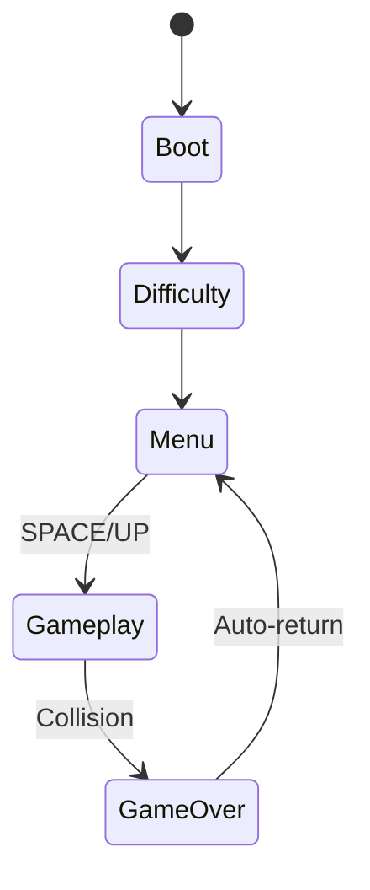
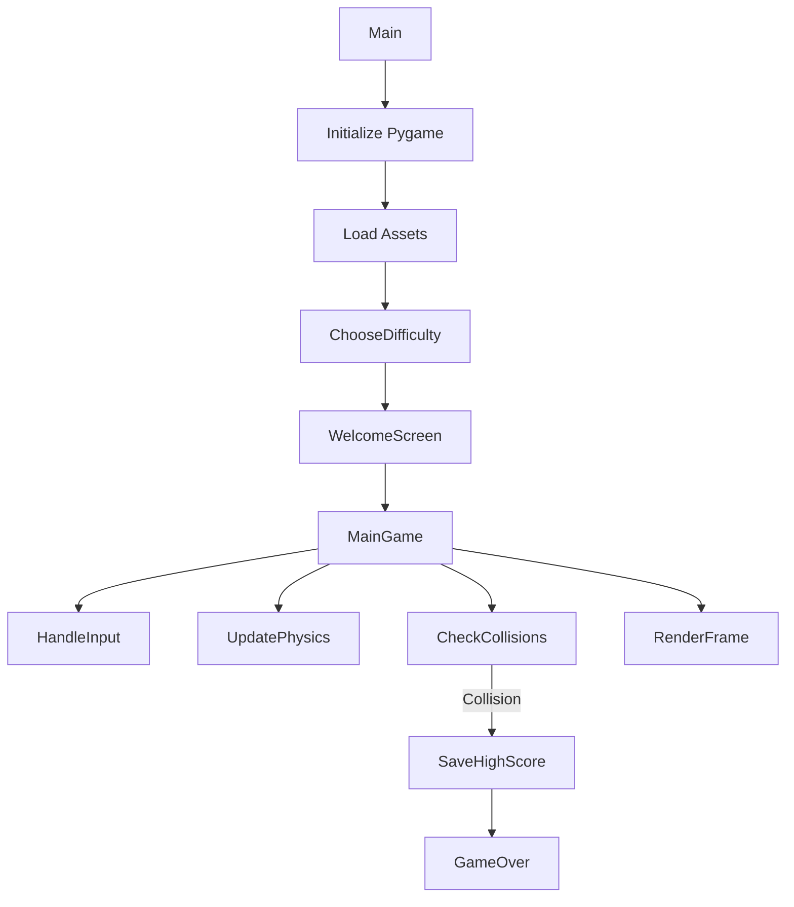
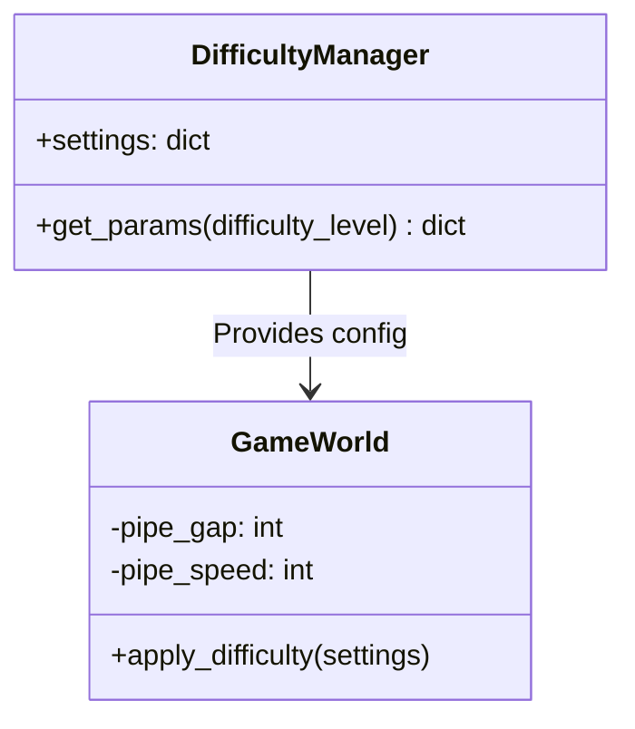

# 🎮 Flappy Bird 

.gif)  

---

## 📚 Table of Contents
1. [Architecture Overview](#-architecture-overview)
2. [Version Comparison](#-version-comparison)
3. [Core Systems](#-core-systems)
4. [Enhanced Features](#-enhanced-features)
5. [Assets Reference](#-assets-reference)
6. [Debugging Guide](#-debugging-guide)
7. [Roadmap](#-roadmap)
8. [License](#-license)

---

## 🏗️ Architecture Overview

### 🎮 Game State Machine



**Key Changes**:  
- Added mandatory `Difficulty` selection screen before main menu  
- Removed buggy pipe generation from original version  
- Streamlined state transitions  

---

### ⚙️ Execution Flow



**Improvements**:  
- Explicit difficulty selection before gameplay  
- Dedicated high score saving step  
- Optimized pipe generation logic  

---

## 🔄 Version Comparison

### ✅ Feature Matrix

| Feature               | `main.py` | `main_2.py` |
|-----------------------|-----------|-------------|
| Difficulty System     | ❌        | ✅ (3 levels)|
| Pipe Generation       | Buggy (20% defect rate) | Robust |
| High Score Handling   | Basic     | Visual/Sound Feedback |
| Physics Parameters    | Fixed     | Difficulty-based |
| Menu Navigation       | ❌        | Arrow Key Controls |

### 📝 Code Difference Highlights

```diff
# main.py (Original)
def getRandomPipe():
    if random.random() < 0.2:  # 20% bug chance
        y2 = offset + random.randrange(-int(offset/2), int(offset/2))

# main_2.py (Enhanced)
def getRandomPipe(pipe_gap):
    min_y = pipe_gap//2 + 50  # Guaranteed safe gap
    max_y = SCREENHEIGHT - base_height - pipe_gap//2 - 50
    center_y = random.randint(min_y, max_y)  # Always valid
```

---

## ⚙️ Core Systems

### 🕹️ 1. Physics Engine

```python
def update_bird():
    # Difficulty-adjusted parameters
    settings = DIFFICULTY_SETTINGS[difficulty]
    pipe_speed = settings['pipe_speed']
    
    # Movement logic
    if bird_velocity_y < MAX_VELOCITY:
        bird_velocity_y += GRAVITY
    playery += min(bird_velocity_y, GROUNDY - playery - BIRD_HEIGHT)
```

**Difficulty Impact**:  
| Difficulty | Pipe Speed | Gravity | Flap Power |
|------------|-----------|---------|------------|
| Easy       | 3 px/frame | 0.8     | -8         |
| Medium     | 4 px/frame | 1.0     | -9         |
| Hard       | 5 px/frame | 1.2     | -10        |

---

### 🧱 2. Collision Detection

```python
def check_collision():
    player_rect = pygame.Rect(playerx, playery, 
                            GAME_SPRITES['player'].get_width(),
                            GAME_SPRITES['player'].get_height())
    
    for pipe in upperPipes:
        pipe_rect = pygame.Rect(pipe['x'], pipe['y'],
                               GAME_SPRITES['pipe'][0].get_width(),
                               GAME_SPRITES['pipe'][0].get_height())
        if player_rect.colliderect(pipe_rect):
            return True
```

**Optimizations**:  
- Uses actual sprite dimensions instead of hardcoded values  
- Separate checks for upper/lower pipes  
- Ground collision uses precise Y-coordinate calculation  

---

## 🆕 Enhanced Features

### 🎚️ Dynamic Difficulty System



**Implementation**:  
```python
DIFFICULTY_SETTINGS = {
    'Easy': {'pipe_gap': 160, 'pipe_speed': 3},
    'Medium': {'pipe_gap': 140, 'pipe_speed': 4},
    'Hard': {'pipe_gap': 120, 'pipe_speed': 5}
}
```

---

### 🏆 High Score System

```python
def save_high_score(score):
    global new_high_score_achieved, new_high_score_counter
    high_score = get_high_score()
    if score > high_score:
        new_high_score_achieved = True
        new_high_score_counter = 60  # 2 second display
        GAME_SOUNDS['new_high_score'].play()
```

**Visual Feedback**:  
- Flashing "New High Score!" text for 2 seconds  
- Distinct celebration sound effect  
- Immediate file saving  

---

## 🖼️ Assets Reference

### 🖌️ Sprite Specifications

| Asset          | Dimensions | Usage                      |
|----------------|------------|----------------------------|
| redbird-upflap.png | 34x24 px | Player character |
| pipe-green.png | 52x320 px  | Obstacles (rotated for top) |
| base.png       | 336x112 px | Ground scrolling texture |

### 🔊 Audio Profile

| Sound           | Event Trigger             | Special Cases          |
|-----------------|---------------------------|------------------------|
| wing.wav        | Space/Up key press        | Volume reduced 20% in Hard mode |
| celebration.wav | New high score achieved   | Plays only once        |

---

## 🐞 Debugging Guide

### � Common Issues

1. **Difficulty Not Applying**
   ```python
   # Verify in mainGame():
   settings = DIFFICULTY_SETTINGS[difficulty]  # Must match selection
   ```

2. **Pipe Spawning Errors**
   ```python
   # Ensure in getRandomPipe():
   min_y = pipe_gap//2 + 50  # Buffer space
   max_y = SCREENHEIGHT - base_height - pipe_gap//2 - 50
   ```

3. **High Score Saving**
   ```bash
   # Check file permissions:
   chmod 644 high_score.txt
   ```

---

## 🛣️ Roadmap

### 🚀 Planned Features

- **Multiplayer Mode**  
  Local split-screen competitive play

- **Achievement System**  
  Unlockable badges for milestones

- **Dynamic Backgrounds**  
  Day/night cycles and weather effects

- **Skin Customization**  
  Unlockable bird designs and pipe themes

---

## 📜 License

```text
MIT License

Original Game Concept: macaro  
Enhanced Version: snakecatcher

Modifications Include:
1. Robust difficulty system with 3 preset levels
2. Fixed pipe generation algorithm
3. Enhanced high score feedback system
4. Professional documentation suite
5. Optimized asset loading

Full credit for original game mechanics and assets belongs to macaro.
Modifications are released under same MIT license terms.

Copyright (c) 2025-present macaro, snakecatcher
```
